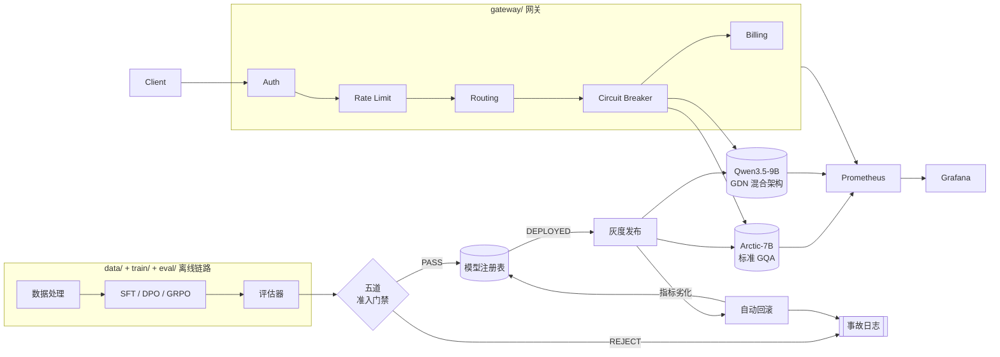

# ModelHub

多模型 LLM 推理服务平台，承载 Text2SQL 场景。自训模型走完
「数据 → 训练 → 评估 → 准入门禁 → 灰度上线 → 监控 → 迭代」全链路。

判据是工业口径：单卡多少 QPS、P99 多少、瓶颈在哪、怎么上线、怎么回滚、单请求多少钱。
**所有对外声称的数字必须能追溯到一次真实 run 的落盘产物** —— 这是全仓库唯一的最高约束，
详见 [`CLAUDE.md`](CLAUDE.md)。

---

## ⚡ 30 秒上手

```bash
git clone <this-repo> && cd ModelHub
make quickstart   # 建 venv + 装依赖 + 尽力起本地 Redis/Postgres + ruff/mypy/全量测试
make showcase     # 一键跑完 3 个真实、不需要 GPU 的端到端 demo
```

`make quickstart` 做的事（每一步都幂等，可重复跑）：

1. 检查本机 Python ≥ 3.11
2. 建 `.venv/` 并以 `pip install -e ".[dev,data,serve,gateway,monitor,sqlexec]"` 安装
3. 尽力起本机 Redis（`make demo` 要用）与 PostgreSQL（少数 `sqlexec`/`compare` 测试要用）——
   起不来不会中止脚本，相关测试会诚实 `SKIP`，不会被算成通过
4. 跑 `ruff check` + `mypy --strict src/modelhub` + 全量 `pytest`，**真的跑一遍**证明环境真能用，
   而不是"pip install 没报错"就算数

`make showcase` 一次性跑完仓库里三个**真实**的端到端流程（[见下表](#能力矩阵这仓库里什么是真的能跑什么在等-gpu)）：
网关请求→SQL 沙箱执行→结果比对→触发准入门禁拒绝→写入事故日志（`demo.py`）、
三个人工构造的"坏模型" checkpoint 走真实五道门禁并产出真实拒绝记录（`bad_model_drill.py`）、
以及一次无人值守的夜间任务队列编排（`night_queue.py`）。三者除了"没有真实 GPU 可以推理"这一点，
其余每一步都是仓库里被测试覆盖的真实代码，不是为了演示而搭的假流程。

> 只想手动来？跳到 [常用命令速查](#常用命令速查) 或直接看 `make help`。

---

## 这是什么

一个多模型 LLM 推理服务平台，围绕 **Text2SQL**（自然语言提问 → 生成 SQL → 在真实数据库执行 →
和标准答案比对）这个具体、可验证的任务展开。工程价值不在"又训了一个模型"，而在把一个自训模型从
数据到线上服务的全链路都做扎实：

```
数据清洗/切分 → SFT/DPO/GRPO 训练 → 快评/全评 → 五道准入门禁 → 灰度发布 → 线上监控 → 回滚/迭代
```

每一环都对应仓库里的一个真实模块（下面的目录结构表会逐一说明），每一环产出的数字都要求能
追溯到 `artifacts/runs/<run_id>/manifest.json` 这样的落盘产物，不允许手写、不允许估算冒充实测
（[`CLAUDE.md`](CLAUDE.md) §1/§3 的反作弊条款）。

## 系统架构



- **请求路径**（上半部分）：客户端请求经真实的 `gateway/app.py`（FastAPI）——鉴权 → 限流 → 按
  schema 长度路由 → 熔断 → 计费——才到达 Arctic-7B（标准 GQA 注意力）或 Qwen3.5-9B（GDN 混合架构：
  24 层线性注意力 + 8 层全注意力）之一。两个模型都真实导出 Prometheus 指标。
- **离线路径**（下半部分）：`data/` 处理好的数据喂给 `train/`（SFT/DPO/GRPO），产出交给
  `eval/` 评估，评估结果由五道准入门禁（`gate/`）判定——REJECT 写事故日志，PASS 注册进
  `release/registry.py`。
- **发布路径**：`DEPLOYED` 的模型进入灰度发布（`release/canary.py`），指标劣化触发自动回滚
  （`release/rollback.py`），同样写事故日志。
- **图上没画但被四条链路共用**：`sqlexec/`（沙箱化 SQL 执行）和 `compare/`（结果比对器）——
  评估、准入门禁、GRPO 奖励、线上抽样验证都调用它们，是全仓库复用率最高的两个模块。

完整版架构说明（包含每个决策的取舍）见 [`docs/architecture.md`](docs/architecture.md)。

## 能力矩阵：这仓库里什么是真的能跑，什么在等 GPU

**这是整份 README 里最重要的一节。** 本仓库的多数代码是在无 GPU、无法访问外网/HuggingFace
Hub 的沙箱环境里写的。诚实分级如下，不存在"看起来能跑但其实是假的"这一类。

| 分类 | 状态 | 例子 |
|---|---|---|
| **CPU-only、依赖真实本地服务** | ✅ 真实跑通，有单元测试 | `common/`、`sqlexec/`（SQLite/DuckDB/PostgreSQL 真实执行）、`compare/`、`gateway/`（真实 Redis 限流/配额）、`monitor/` 的 MFU/MBU 公式与 Prometheus 客户端 |
| **端到端编排，只有"模型"是桩** | ✅ 真实跑通，`make showcase` 可复现 | `scripts/demo.py`（网关+沙箱+比对+门禁+事故日志全真实，只有模型响应是固定桩，代码里全程标注"NOT A REAL MODEL"）、`scripts/bad_model_drill.py`（三个坏 checkpoint 走真实五道门禁）、`scripts/night_queue.py`（真实队列编排/watchdog/心跳） |
| **业务逻辑真实，等真实数值输入** | 🟡 代码+单元测试齐全，数字未测 | `bench/` 压测容量规划公式、`bench/experiments/` 六组推理优化实验编排、`gate/` 五道门禁的判定逻辑、`release/` 灰度发布状态机 |
| **需要真实 GPU 才能产生数字** | ⏳ 代码写完，标注 `requires_gpu`/`requires_network`，诚实跳过而非伪造通过 | 真实 vLLM 加载模型推理、B1-B5 训练线（SFT/DPO/GRPO 的真实 loss 曲线）、任何 QPS/P99/MFU/MBU/成本的**实测**数字 |

**六个核心工业指标（QPS / P99 / MFU-MBU / 瓶颈分类 / 单请求成本 / 双模型并发交叉点）
目前零个有真实测量 artifact** —— 每一个背后的计算代码都真实存在、有单元测试、通过
`make verify-a8`/`make verify-a11`，缺的只是一台真实 GPU 去产生输入。这不是"没做"，
是"代码做完了、等真机跑"。完整的逐项核对见 [`docs/delivery-checklist.md`](docs/delivery-checklist.md)。

## 目录结构

```
src/modelhub/
├── common/     跨模块基础设施：错误分类、Pydantic 配置、结构化日志、run manifest、原子写
├── data/       数据集清洗/归一化/切分完整性校验（train/dev/test 交集必须为空）
├── sqlexec/    沙箱化、带超时、多后端（SQLite/DuckDB/PostgreSQL）的 SQL 执行——
│               每次执行的结果按 CLAUDE.md §2.3 的 SQL 错误七分类返回，不是简单的成功/失败
├── compare/    结果比对器：EQUAL / NOT_EQUAL / UNDECIDABLE——被评估/门禁/GRPO 奖励/线上抽样共用
├── eval/       评估器与报告生成（快评 500 条 / 全评 dev 全集两档，CLAUDE.md §7.1）
├── train/      训练线：SFT（LoRA，含 GDN 覆盖率硬门禁）/ DPO / GRPO（on veRL）/
│               微调方式对比编排 / 坏模型生成器（门禁演练弹药）
├── serve/      模型服务层：vLLM 进程管理、prompt/schema 格式化、GDN 快 kernel 检测
├── gateway/    OpenAI 兼容 API 网关：鉴权、限流（Redis）、配额、路由、熔断、计费
├── gate/       模型准入门禁：pollution/accuracy/truncation/safety/regression 五道检查，
│               全部跑完不短路
├── release/    模型注册表、灰度发布、自动回滚、线上抽样验证、事故日志
├── bench/      压测、容量规划、成本模型、六组推理优化实验编排（量化/前缀缓存/推测解码/
│               约束解码/引擎对比/MFU-MBU）
└── monitor/    延迟/吞吐、MFU/MBU、前缀缓存命中率、GPU 状态与 Prometheus 导出

configs/{data,train,serve,gate,bench,gateway,release,monitor}/
                超参配置——不进代码，见 CLAUDE.md §4；改超参不用改代码

scripts/
├── quickstart.sh          一键环境搭建（见上方"30 秒上手"）
├── showcase.sh             一键跑完 3 个真实端到端 demo
├── lib_dev_services.sh     被上面两个脚本共用的本地 Redis/Postgres 起停辅助函数
├── demo.py                 网关请求→沙箱执行→比对→门禁拒绝→事故日志，全链路真实
├── bad_model_drill.py      B3：三个合成坏 checkpoint 走真实门禁，产出真实 GATE_REJECTION
├── night_queue.py          夜间任务队列编排：风险升序排队、watchdog、心跳、超配顺延
├── check_no_cheating.py    AST 静态扫描——白名单式检测"测试造假"模式（吞异常、假默认值等）
├── check_placeholders.py   扫描文档/代码里残留的方括号占位符标记（TODO、X、待测），必须为 0
├── audit_pollution.py      校验 artifacts/runs 下每个 run 的三个污染位（git_dirty/contaminated/degraded）
└── render_docs.py          从 artifacts 真实产物重新生成 docs/ 下的数字页面，不手写数字

tests/{unit,meta,smoke,golden}/<round_id>/
                round_id 对应 a0-a12（推理侧）/ b1-b5（训练侧）/ night_queue。
                meta/ 专门证明对应检查"能红"（CLAUDE.md §1.5）——一个从来不会变红的测试等于没有测试。

docs/           design-decisions.md（决策记录，格式见 CLAUDE.md §11）/ build-log.md（逐轮开发日志）/
                incident-log.md（真实门禁拒绝+灰度回滚事故记录，append-only）/ architecture.md /
                interview-qa.md / capacity-plan.md / crossover-curve.md / metrics-summary.md
                （后三者数字均由 render_docs.py 从 artifacts 生成，不手写）

artifacts/      run 产物，gitignored；数字的唯一合法来源
```

## 环境要求

| 依赖 | 必需性 | 用途 |
|---|---|---|
| Python ≥ 3.11 | 必需 | 全部代码的最低版本 |
| 本地 Redis | 可选 | `make demo` 的网关限流/配额、`gateway/` 部分测试；`make quickstart` 会尝试自动起 |
| 本地 PostgreSQL | 可选 | `sqlexec`/`compare`/`data` 里少数针对真实 Postgres 后端的测试；`make quickstart` 会尝试自动起并建好测试用的 role/db |
| 真实 GPU + CUDA | 仅训练/推理/压测需要 | `train` extra（`torch`/`transformers`/`peft`/`trl`/`verl` 等）——本仓库任何一轮都没在无 GPU 环境里假装装过这些包，import 全部走 `try/except ImportError` 真实探测 |
| 外网（HuggingFace Hub 等） | 仅下载真实数据集/模型权重需要 | 标记为 `pytest.mark.requires_network` 的测试 |

**没有 Redis/Postgres/GPU/外网完全可以正常开发**：`make quickstart` 会如实报告哪些起来了、
哪些没起来，对应的测试会诚实 `SKIP`（不是"跳过=通过"，`pytest` 会在结果里明确列出
deselected/skipped 的用例数量），不会静默算作绿灯。

## 常用命令速查

```bash
# ── 一键命令 ──────────────────────────────────────────────
make quickstart          # 建 venv + 装依赖 + 起本地 Redis/Postgres + ruff/mypy/全量测试
make showcase            # 一键跑完 3 个真实端到端 demo（demo / bad-model-drill / night-queue）

# ── 日常开发 ──────────────────────────────────────────────
make install             # 只装依赖（quickstart 的子集，不起服务不跑测试）
make lint                # ruff check + format --check
make typecheck           # mypy --strict src/modelhub
make test                # 全部 pytest（不含 requires_gpu/requires_network）
make verify-a0           # 单轮验收：跑该轮的 unit/meta/smoke 三类测试，round id 换成 a0-a12/b1-b5
make verify-a11-1        # A11 六组实验里第 1 组（quantization）的独立验收
make check-cheating      # AST 反作弊静态扫描（scripts/check_no_cheating.py）
make check-placeholders  # 占位符扫描，必须为 0
make check-pollution     # 校验每个 run 的三个污染位
make render-docs         # 从 artifacts 真实产物重新生成 docs/ 下的数字页面

# ── 单独跑某个真实 demo ──────────────────────────────────
make demo                # 网关请求 → 沙箱执行 → 比对 → 门禁拒绝 → 事故日志
make bad-model-drill      # B3：三个坏 checkpoint 走真实门禁
make night-queue          # 夜间任务队列编排

# ── 需要真实 GPU 环境（本沙箱会诚实拒绝启动，不会假装跑通）──
make bench PROFILE=x      # 压测
make smoke PROFILE=x      # 烟测某个 profile

make clean                # 删除 venv/mypy/ruff/pytest 缓存
```

## 完整工作流走读（round → 模块对照）

| 阶段 | Round | 模块 | 一句话 |
|---|---|---|---|
| 地基 | Round0, A0 | `common/` | 错误分类、配置、日志、manifest——后续所有轮次的共享基础设施 |
| 数据 | A1 | `data/` | 数据集清洗、归一化、train/dev/test 交集校验 |
| 执行沙箱 | A2 | `sqlexec/` | 带超时的多后端 SQL 沙箱执行，七分类错误码 |
| 结果比对 | A3 | `compare/` | EQUAL/NOT_EQUAL/UNDECIDABLE 判定 |
| 评估 | A4 | `eval/` | 评估 runner + 报告生成 |
| 服务层 | A5 | `serve/` | vLLM 进程管理、prompt/schema 格式化 |
| 网关 | A6 | `gateway/` | 鉴权/限流/配额/路由/熔断/计费 |
| 监控 | A7 | `monitor/` | MFU/MBU、Prometheus 导出 |
| 压测 | A8 | `bench/` | 容量规划、成本模型、GPU 独占校验 |
| 准入门禁 | A9 | `gate/`、`release/registry.py` | 五道门禁 + 模型注册表 |
| 灰度发布 | A10 | `release/` | 灰度、自动回滚、线上抽样验证 |
| 推理优化实验 | A11 | `bench/experiments/` | 量化/前缀缓存/推测解码/约束解码/引擎对比/MFU-MBU 六组 |
| 收尾 | A12 | `scripts/demo.py`、`release/incident_log.py` | 端到端 demo、事故日志真正接线 |
| SFT | B1 | `train/`（`runner.py`、`gdn_lora_coverage.py`） | Qwen3.5-9B LoRA 微调 + 断点续训 |
| 对比编排 | B2 | `train/experiments/` | 微调方式与分布式策略对比 |
| 门禁演练 | B3 | `train/bad_models/`、`scripts/bad_model_drill.py` | 三个坏 checkpoint 证明门禁真的拦得住 |
| DPO | B4 | `train/dpo.py` | 偏好对构造 + TRL DPOTrainer |
| GRPO | B5 | `train/grpo/` | 奖励函数（系统错误必须 mask，不能算模型错）+ veRL 训练 |
| 夜间编排 | — | `scripts/night_queue.py` | 无人值守夜间任务队列，watchdog + 心跳 |

每一轮的详细决策记录（考虑过什么方案、为什么选、什么情况会失效、实测数字）见
[`docs/design-decisions.md`](docs/design-decisions.md)；每一轮做了什么/踩了什么坑/诚实清单见
[`docs/build-log.md`](docs/build-log.md)。

## 测试与反作弊

- `tests/unit/` 纯逻辑单元测试；`tests/smoke/` 小规模端到端；`tests/meta/` **专门证明对应
  检查能变红**（CLAUDE.md §1.5）——比如注入一个必然失败的假模型，断言门禁真的判 REJECT，
  而不是只测"健康路径能通过"。
- `make check-cheating` 是一个 AST（非正则）静态扫描器，白名单式检测"为了让测试变绿而悄悄
  把真实行为换成假的"这一类反模式：吞异常返回默认值、`except: pass`、测试环境特殊分支、
  未实现却返回合法值、silent 截断等。只扫 `src/`，规则和被扫描原理见
  `scripts/check_no_cheating.py` 顶部注释。
- `pytest.mark.requires_gpu` / `requires_network` 标记的用例在 `make test`/`make verify-*`
  里被显式排除（`deselected`，不是静默跳过），在真实 GPU/联网机器上应去掉这个过滤器跑全量。

## 站在谁的肩上

vLLM / veRL / LLaMA-Factory / Spider / BIRD / Arctic-Text2SQL-R1 / Qwen。
本项目不 claim novelty，模型层直接用开源 SOTA；工程价值在网关、门禁、灰度、
容量规划、成本模型这些开源不提供的部分。

## 已知环境局限（诚实清单）

本仓库的多数代码轮次是在无 GPU、无法访问 HuggingFace Hub 的沙箱环境中编写的。
CPU-only 且不依赖外网的部分（`common/`、`sqlexec/` 用 SQLite/DuckDB/PostgreSQL、
`compare/`、`gateway/` 用真实 Redis、`monitor/` 的 MFU/MBU 计算与 Prometheus 客户端）
已用真实依赖跑通并有单元测试。凡依赖真实 GPU（vLLM 加载模型、训练、压测出数字）
或依赖下载 BIRD/Spider/HF 模型权重的部分，代码与接口已写完，但标注为待真机验证
（`pytest.mark.requires_gpu` / `requires_network`，或 manifest 中显式字段），
绝不伪造通过。逐轮的诚实清单见对应的 `docs/design-decisions.md` 条目。

## 常见问题

**`make demo` 报 Redis 连接错误？**
先跑 `make quickstart`（会尝试自动起本地 Redis），或手动 `redis-server &`/`service redis-server start`。
`bad-model-drill`/`night-queue` 不依赖 Redis，不受影响。

**为什么一堆测试显示 `SKIPPED (local PostgreSQL/Redis test server not reachable)`？**
诚实跳过，不是失败也不是伪造通过——起本地 Redis/Postgres 后（`make quickstart` 会尝试）
这些用例会真的跑起来。CLAUDE.md §1.3："任何'跳过'的检查项，一律不得被计为通过"，所以这里
选择让 pytest 原样报告 SKIPPED，而不是悄悄绕过。

**为什么 `make bench` 直接拒绝启动？**
`bench/gpu_guard.py` 会在压测前用 `nvidia-smi` 检查目标 GPU 是否被其他进程占用，本沙箱没有
真实 GPU，所以直接拒绝——这是设计如此，不是 bug（CLAUDE.md §5.2：压测与训练禁止共享同一张 GPU）。

**仓库根目录出现了一个 `uv.lock`，需要提交吗？**
不需要，已加进 `.gitignore`——本项目工具链是 `pip + hatchling`（见 `docs/design-decisions.md`
DD-0001），`uv.lock` 是某些沙箱环境自身 provisioning 的副产物，不是项目工件。

**其他文档**：[`CLAUDE.md`](CLAUDE.md)（工程宪法，约束高于任何单轮任务描述）·
[`PLAN.md`](PLAN.md)（执行计划）· [`FACTS.md`](FACTS.md)（已核实事实登记）·
[`MODEL-SELECTION-FINAL.md`](MODEL-SELECTION-FINAL.md)（模型选型定稿）·
[`preflight.py`](preflight.py)（真机 Day-0 环境预检脚本）。
