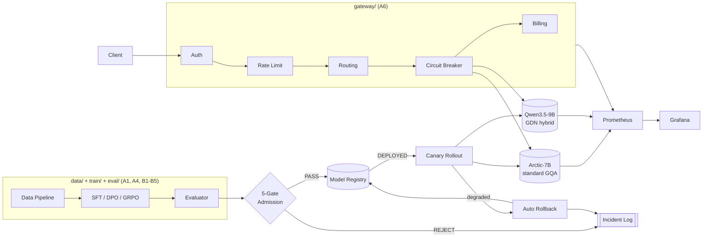

# ModelHub · Architecture

PLAN.md A12 item 4: a diagram simple enough to hand-draw on a whiteboard
— not a complete component inventory. Boxes map to the round(s) that
own them; see `docs/design-decisions.md` for why each piece looks the
way it does.

## Reading it

- **Request path** (top): a client hits the real `gateway/app.py`
  (A6+A12) — auth → rate limit → schema-length-based routing → circuit
  breaker → billing — before reaching one of the two served models.
  Both models and the gateway export real Prometheus metrics
  (`monitor/exporter.py`, A7); Grafana reads from there.
- **Two models, on purpose** (CLAUDE.md §0): Arctic-7B (standard GQA
  attention) and Qwen3.5-9B (GDN hybrid — 24 linear-attention layers + 8
  full-attention layers) are architecturally different by design, not a
  placeholder pair — their KV-cache economics cross somewhere in the
  1k–3k prompt-token range (`docs/crossover-curve.md`, currently a
  planning estimate — see the honesty note in the delivery checklist),
  which is what `gateway/routing.py`'s threshold is meant to encode
  once a real bench run backfills it.
- **Offline path** (bottom): `data/` (A1) feeds `train/` (B1/B4/B5) feeds
  `eval/` (A4), which produces the predictions and metrics the five-gate
  admission verdict (`gate/`, A9) judges. A REJECT writes to the incident
  log (A12); a PASS registers the candidate (`release/registry.py`, A9).
- **Release path**: a `DEPLOYED` model enters a staged canary rollout
  (`release/canary.py`, A10) serving a growing percentage of traffic; a
  health regression triggers an automatic rollback
  (`release/rollback.py`, A10), which also writes to the incident log
  and flips the registry entry back.
- **Not shown**: `sqlexec/` (A2) and `compare/` (A3) — the SQL-execution
  sandbox and result comparator every one of eval/gate/train's boxes
  above calls into internally. They're the most-reused modules in the
  project (CLAUDE.md: "评估、门禁、GRPO 奖励、线上监控四条链路共用它")
  but drawing them as their own boxes would turn this into exactly the
  "too complex to hand-draw" diagram PLAN.md asked to avoid.
